---
## Front matter
lang: ru-RU
title: Лабораторная работа №1
subtitle: Операционные системы
author:
  - Гаязов Рузаль, НКАбд-04-24
institute:
  - Российский университет дружбы народов, Москва, Россия
date: 18 февраля 2023

## i18n babel
babel-lang: russian
babel-otherlangs: english

## Formatting pdf
toc: false
toc-title: Содержание
slide_level: 2
aspectratio: 169
section-titles: true
theme: metropolis
header-includes:
 - \metroset{progressbar=frametitle,sectionpage=progressbar,numbering=fraction}
 - '\makeatletter'
 - '\beamer@ignorenonframefalse'
 - '\makeatother'
---

#Информация

## Цель работы

Цель данной лабораторной работы -- изучение идеологии и применения средств контроля версий, освоение умения по работе с git.

## Задание

1. Создать базовую конфигурацию для работы с git
2. Создать ключ SSH
3. Создать ключ GPG
4. Настроить подписи Git
5. Заргеистрироваться на GitHub
6. Создать локальный каталог для выполнения заданий по предмету.

## Установка программного обеспечения

Устанавливаю необходимое программное обеспечение git и gh через терминал с помощью команд: dnf install git и dnf install gh (рис. @fig:001).

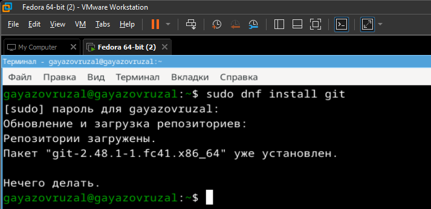{#fig:001 width=70%}

## Установка программного обеспечения

Задаю в качестве имени и email владельца репозитория свои имя, фамилию и электронную почту (рис. @fig:002).

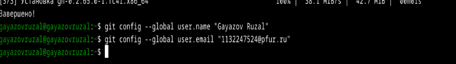{#fig:002 width=70%}

## Установка программного обеспечения

Настраиваю utf-8 в выводе сообщений git для их корректного отображения (рис. @fig:003).

{#fig:003 width=70%}

## Установка программного обеспечения

Начальной ветке задаю имя master (рис. @fig:004).

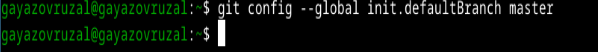{#fig:004 width=70%}

## Установка программного обеспечения

Задаю параметры autocrlf и safecrlf (рис. @fig:005).

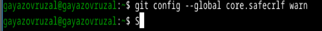{#fig:005 width=70%}

## Создание ключа SSH

Создаю ключ ssh размером 4096 бит по алгоритму rsa (рис. @fig:006).

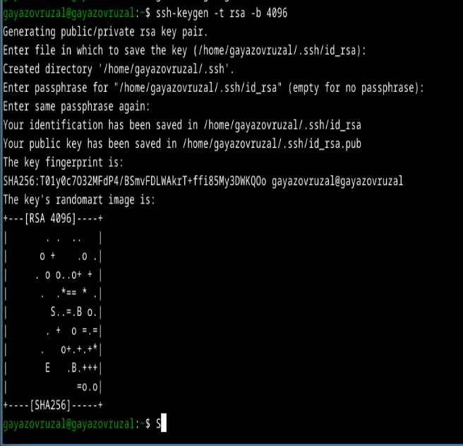{#fig:006 width=70%}

## Создание ключа SSH

Создаю ключ ssh по алгоритму ed25519 (рис. @fig:007).

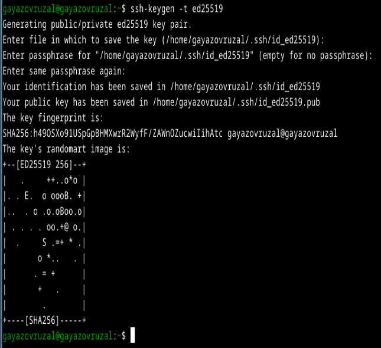{#fig:007 width=70%}

## Создание ключа GPG

Генерирую ключ GPG, затем выбираю тип ключа RSA and RSA, задаю максиммальную длину ключа: 4096, оставляю неограниченный срок действия ключа. Далее отвечаю на вопросы программы о личной информации (рис. @fig:008).

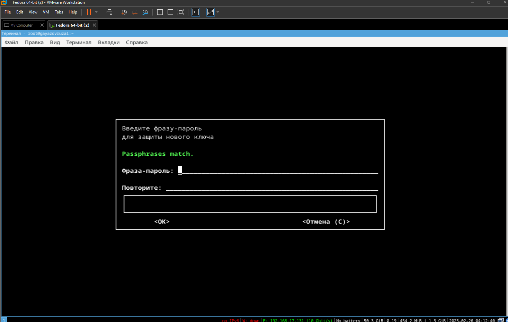{#fig:008 width=70%}

## Создание ключа GPG

Ввожу фразу-пароль для защиты нового ключа (рис. @fig:009).

{#fig:009 width=70%}

## Регистрация на Github

У меня уже был создан аккаунт на Github, соответственно, основные данные аккаунта я так же заполняла и проводила его настройку, поэтому просто вхожу в свой аккаунт (рис. @fig:010).

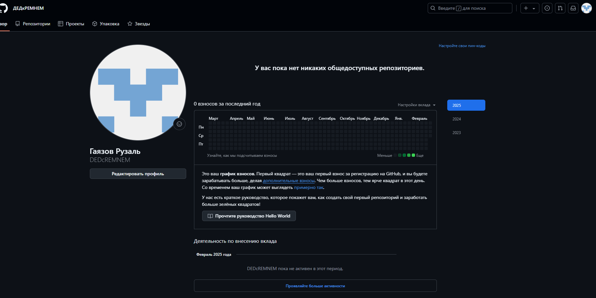{#fig:010 width=70%}

## Добавление ключа GPG в Github

Вывожу список созданных ключей в терминал, ищу в результате запроса отпечаток ключа, он стоит после знака слеша, 
копирую его в буфер обмена (рис. @fig:011).

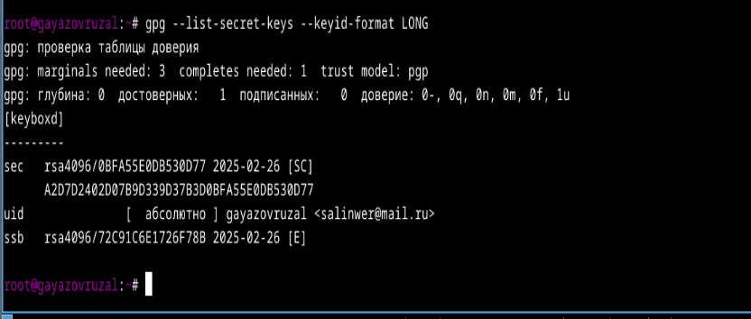{#fig:011 width=70%}

## Добавление ключа GPG в Github

Ввожу в терминале команду, с помощью которой копирую сам ключ GPG в буфер обмена, за это отвечает утилита xclip (рис. @fig:012).

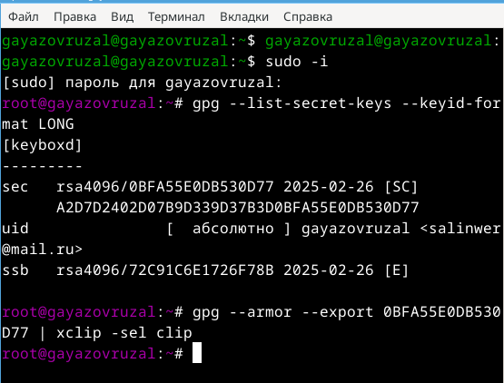{#fig:012 width=70%}

## Добавление ключа GPG в Github

Открываю настройки GirHub, ищу среди них добавление GPG ключа. Нажимаю на "New GPG key" и вставляю в поле ключ из буфера обмена (рис. @fig:013).

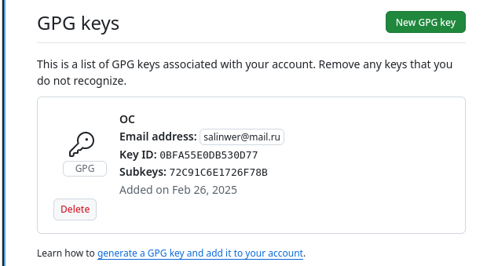{#fig:013 width=70%}

## Настроить подписи Git

Настраиваю автоматические подписи коммитов git: используя введенный ранее email, указываю git использовать его при создании подписей коммитов (рис. @fig:016).

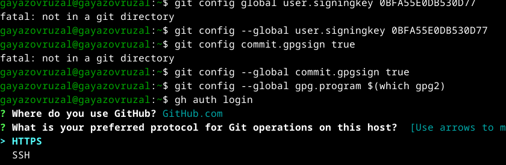{#fig:016 width=70%}

## Настройка gh

Начинаю авторизацию в gh, отвечаю на наводящие вопросы от утилиты, в конце выбираю авторизоваться через браузер (рис. @fig:017).

{#fig:017 width=70%}

## Настройка gh

Завершаю авторизацию на сайте (рис. @fig:018).

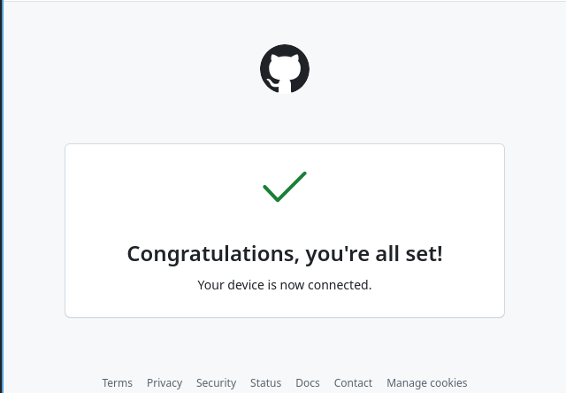{#fig:018 width=70%}

Вижу сообщение о завершении авторизации под именем evdvorkina (рис. @fig:019).

## Настройка gh

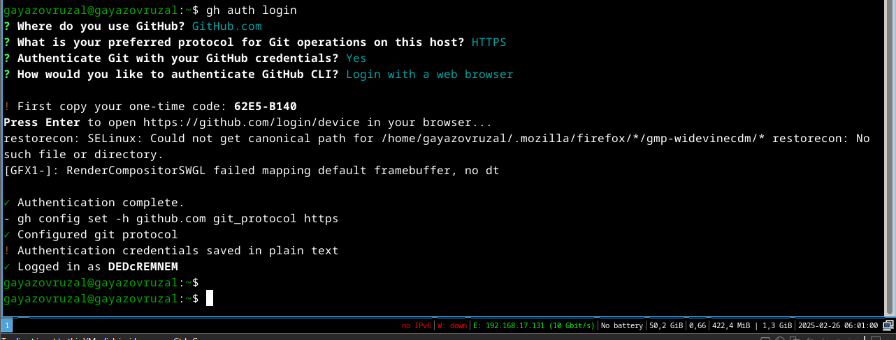{#fig:019 width=70%}

## Создание репозитория курса на основе шаблона

Сначала создаю директорию с помощью утилиты mkdir и флага -p, который позволяет установить каталоги на всем указанном пути. После этого с помощью утилиты cd перехожу в только что созданную директорию "Операционные системы".
Далее в терминале ввожу команду gh repo create study_2022-2023_os-intro --template yamadharma/course-directory-student-trmplate --public, чтобы создать репозиторий на основе шаблона репозитория. После этого клонирую репозиторий к себе в 
директорию, я указываю ссылку с протоколом https, а не ssh, потому что при авторизации в gh выбрала протокол https (рис. @fig:020). 

{#fig:020 width=70%}

## Создание репозитория курса на основе шаблона

Перехожу в каталог курса с помощью утилиты cd, проверяю содержание каталога с помощью утилиты ls (рис. @fig:021).

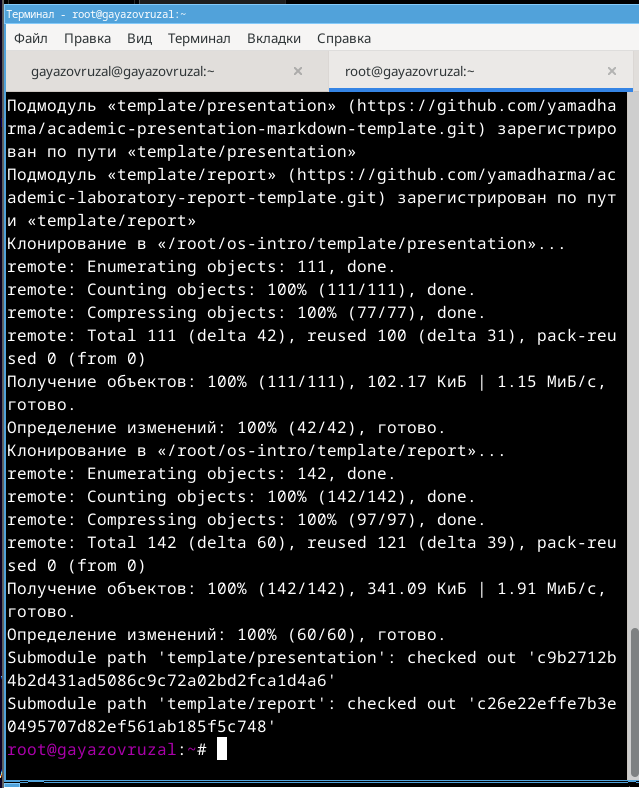{#fig:021 width=70%}

## Создание репозитория курса на основе шаблона

Удаляю лишние файлы с помощью утилиты rm, далее создаю необходимые каталоги используя makefile (рис. @fig:022).

{#fig:022 width=70%}

## Создание репозитория курса на основе шаблона

Добавляю все новые файлы для отправки на сервер с помощью команды git add и комментирую их с помощью git commit.
Отправляю файлы на сервер с помощью git push.

## Выводы

При выполнении данной лабораторной работы я изучила идеологию и применение средств контроля версий, освоила умение по работе с git.

## Список литературы{.unnumbered}

::: {#refs}
1. Лабораторная работа № 2 [Электронный ресурс] URL: https://esystem.rudn.ru/mod/page/view.php?id=970819
:::