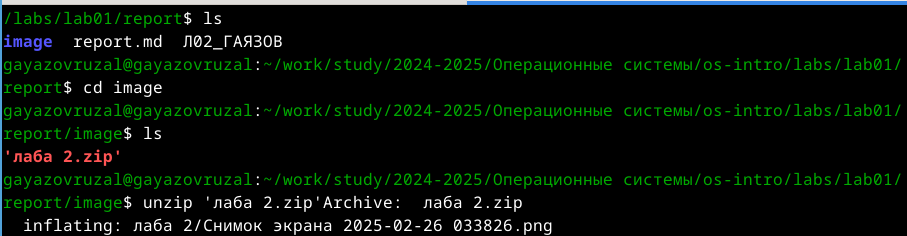
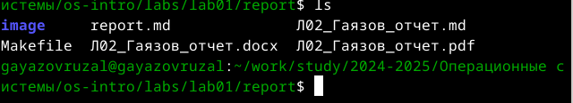
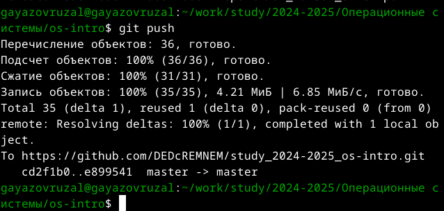

---
## Front matter
lang: ru-RU
title: Лабораторная работа №1
subtitle: Операционные системы
author:
  - Гаязов Рузаль, НКАбд-04-24
institute:
  - Российский университет дружбы народов, Москва, Россия
date: 18 февраля 2023

## i18n babel
babel-lang: russian
babel-otherlangs: english

## Formatting pdf
toc: false
toc-title: Содержание
slide_level: 2
aspectratio: 169
section-titles: true
theme: metropolis
header-includes:
 - \metroset{progressbar=frametitle,sectionpage=progressbar,numbering=fraction}
 - '\makeatletter'
 - '\beamer@ignorenonframefalse'
 - '\makeatother'
---

# Цель работы

Цель данной лабораторной работы - научиться оформлять отчёты с помощью легковесного языка разметки Markdown.

## Задание

1. Сделайте отчёт по предыдущей лабораторной работе в формате Markdown.
2. В качестве отчёта предоставляются отчёты в 3 форматах: pdf, docx и md (в архиве,
поскольку он должен содержать скриншоты, Makefile и т.д.)

## Теоретическое введение

Markdown — облегчённый язык разметки, созданный с целью обозначения форматирования в простом тексте, с максимальным сохранением его читаемости человеком, и пригодный для машинного преобразования в языки для продвинутых публикаций.

## Выполнение лабораторной работы

Перехожу в каталог, в котором находится шаблон для отчета по лабораторной работы, с помощью утилиты cd (рис. @fig:001).

{#fig:001 width=70%}

## Выполнение лабораторной работы

Создаю копию шаблона, в которой буду работать с помощью утилиты cp.
Открываю созданный файл с помощью текстового редактора Mousepad (можно открыть с помощью редактора Kwrite, в нем оказалось удобнее работать) (рис. @fig:002).

{#fig:002 width=70%}

## Выполнение лабораторной работы

В файле cite.bib с помощью текстового редактора Kwrite поработала над списком библиографии, вставив интернет-ресурс, который я использовала.
После изменения шаблона в соответсвии с языком разметки Markdown, я выполнила его компиляцию из формата md в форматы docx и pdf (рис. @fig:003).

{#fig:003 width=70%}

## Выполнение лабораторной работы

Далее отправила созданные и скомпилированные файлы на глобальный репозиторий.
Последнее действие в отправке с помощью компанды git push (рис. @fig:004).

{#fig:004 width=70%}

## Выводы

При выполнении данной лабораторной работы я научилась оформлять отчеты с помощью легковесного языка разметки Markdown.