---
## Front matter
lang: ru-RU
title: Лабораторная работа №1
subtitle: Операционные системы
author:
  - Гаязов Рузаль, НКАбд-04-24
institute:
  - Российский университет дружбы народов, Москва, Россия
date: 18 февраля 2023

## i18n babel
babel-lang: russian
babel-otherlangs: english

## Formatting pdf
toc: false
toc-title: Содержание
slide_level: 2
aspectratio: 169
section-titles: true
theme: metropolis
header-includes:
 - \metroset{progressbar=frametitle,sectionpage=progressbar,numbering=fraction}
 - '\makeatletter'
 - '\beamer@ignorenonframefalse'
 - '\makeatother'
---

## Цель работы

Получение навыков правильной работы с репозиториями git.

## Задание

1. Установка git-flow
2. Установка Node.js
3. Настройка Node.js
4. Общепринятые коммиты
5. Создание репозитория git
6. Работа с репозиторием git

## Установка программного обеспечения

Устанавливаю git-flow (рис. @fig:001).

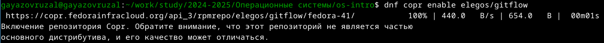{#fig:001 width=70%}

## Установка программного обеспечения

Устанавливаю node.js (рис. @fig:002).

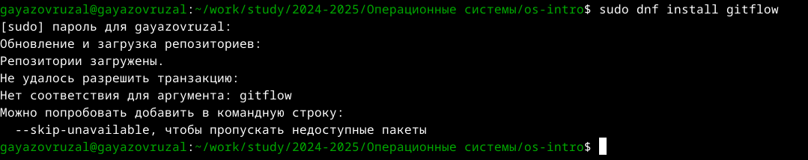{#fig:002 width=70%}

## Установка программного обеспечения

Настраиваю node.js (рис. @fig:003).

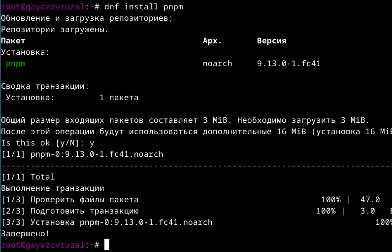{#fig:003 width=70%}

## Установка программного обеспечения

Запускаю pnpm и пишу source ~/.bashrc (рис. @fig:004).

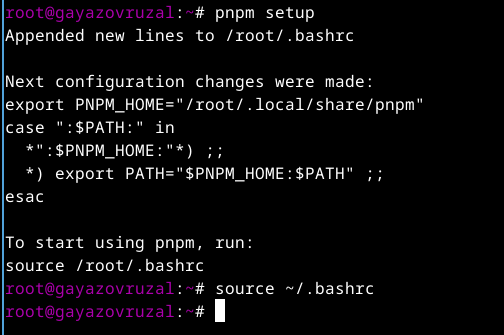{#fig:004 width=70%}

## Установка программного обеспечения

Использую программу для помощи в форматировании коммитов. (рис. @fig:005).

## Установка программного обеспечения

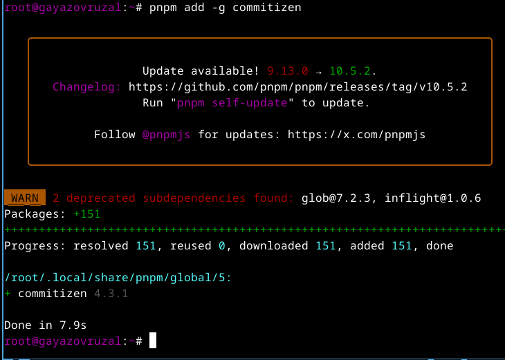{#fig:005 width=70%}

## Установка программного обеспечения

Использую программу для помощи в создании логов. (рис. @fig:006).

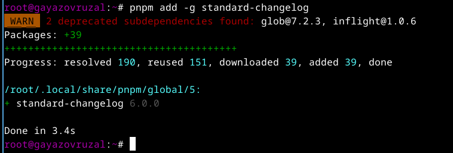{#fig:006 width=70%}

## Практический сценарий использования git

Создаю новый репозиторий на git.
Делаю первый коммит и выкладываю на git (рис. @fig:007).

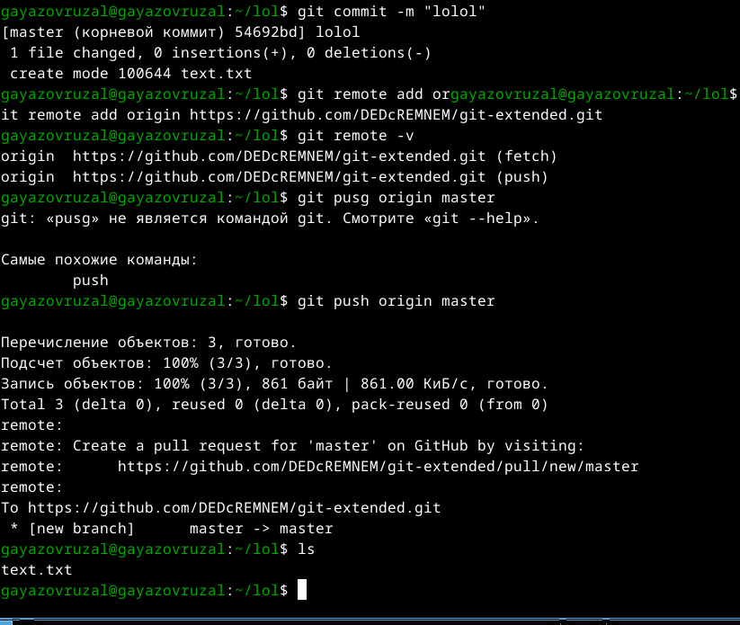{#fig:007 width=70%}

## Практический сценарий использования git

Конфигурирую общепринятые коммиты (рис. @fig:008).

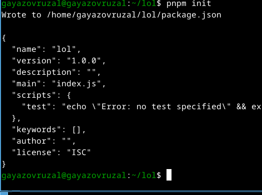{#fig:008 width=70%}

## Практический сценарий использования git

Отправляю все на git (рис. @fig:009).

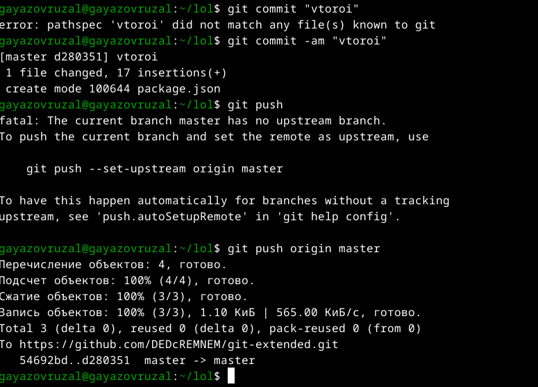{#fig:009 width=70%}

## Практический сценарий использования git

Перехожу на ветку develop (рис. @fig:010).

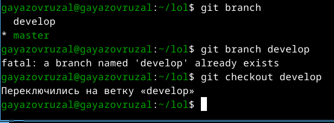{#fig:010 width=70%}

## Практический сценарий использования git

Загружаю весь репозиторий в хранилище и устанавливаю внешнюю ветку как выше стоящую (рис. @fig:011).

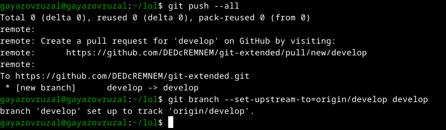{#fig:011 width=70%}

## Практический сценарий использования git

Моя ошибка git-flow (рис. @fig:012).

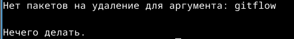{#fig:012 width=70%}

## Выводы

При выполнении лабораторной работы я полученил навыков правильной работы с репозиториями git.

## Список литературы{.unnumbered}

::: {#refs}
1. Лабораторная работа № 4 [Электронный ресурс] URL: https://esystem.rudn.ru/mod/page/view.php?id=970819
:::