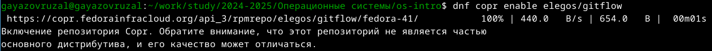
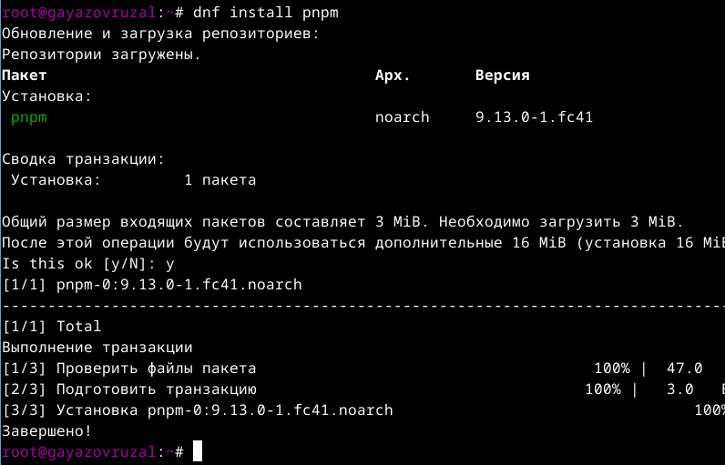
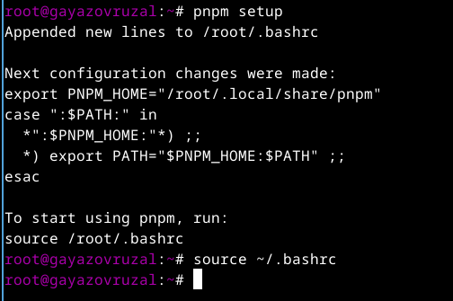
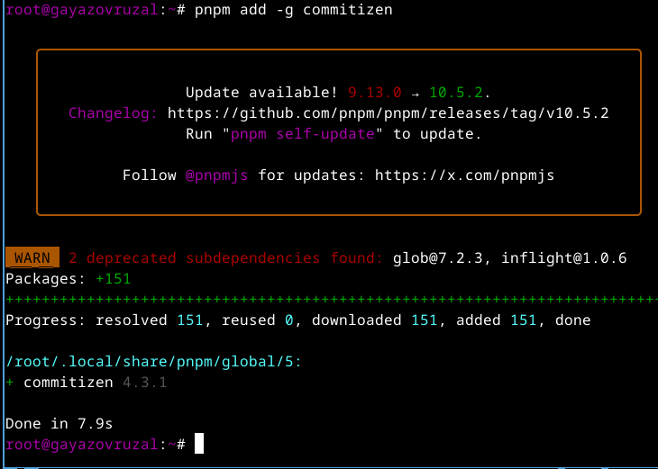
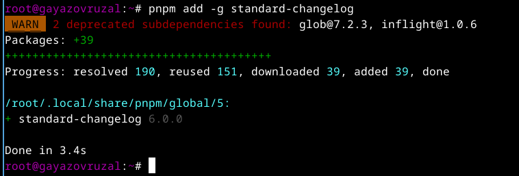
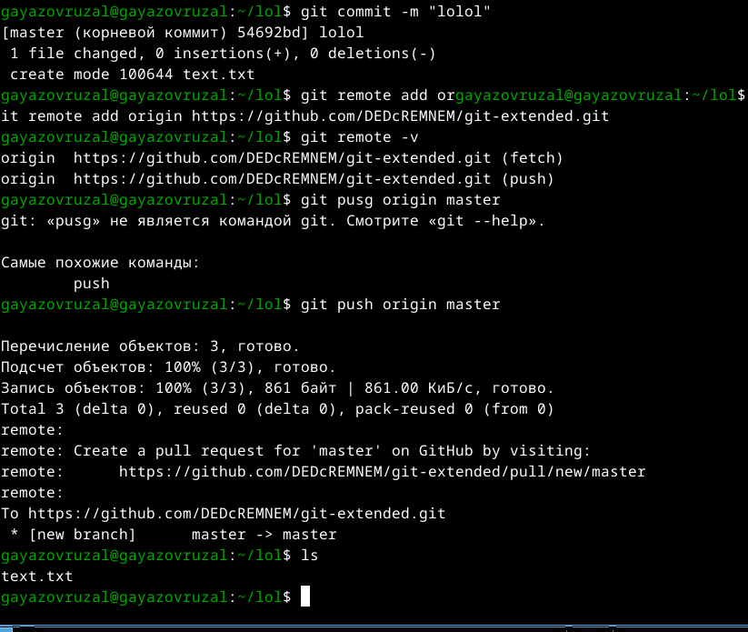
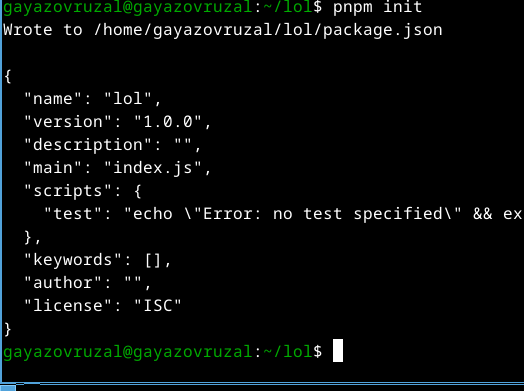
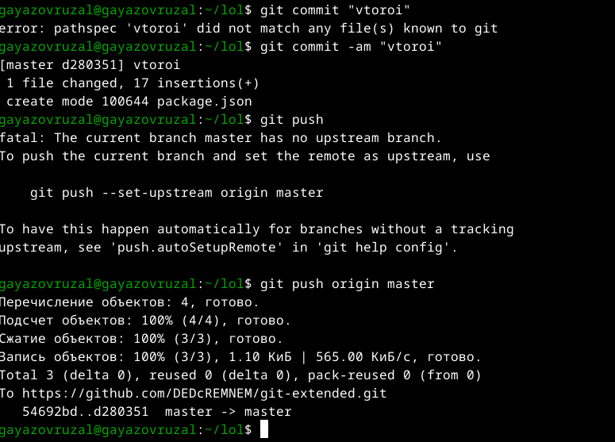
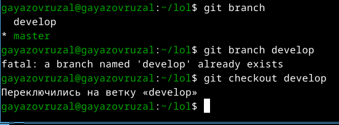
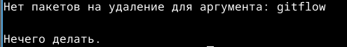

---
## Front matter
title: "Отчет по лабораторной работе №2"
subtitle: "Операционные системы"
author: "Гаязов Рузаль Ильшатович"

## Generic otions
lang: ru-RU
toc-title: "Содержание"

## Bibliography
bibliography: bib/cite.bib
csl: pandoc/csl/gost-r-7-0-5-2008-numeric.csl

## Pdf output format
toc: true # Table of contents
toc-depth: 2
lof: true # List of figures
lot: true # List of tables
fontsize: 12pt
linestretch: 1.5
papersize: a4
documentclass: scrreprt
## I18n polyglossia
polyglossia-lang:
  name: russian
  options:
	- spelling=modern
	- babelshorthands=true
polyglossia-otherlangs:
  name: english
## I18n babel
babel-lang: russian
babel-otherlangs: english
## Fonts
mainfont: PT Serif
romanfont: PT Serif
sansfont: PT Sans
monofont: PT Mono
mainfontoptions: Ligatures=TeX
romanfontoptions: Ligatures=TeX
sansfontoptions: Ligatures=TeX,Scale=MatchLowercase
monofontoptions: Scale=MatchLowercase,Scale=0.9
## Biblatex
biblatex: true
biblio-style: "gost-numeric"
biblatexoptions:
  - parentracker=true
  - backend=biber
  - hyperref=auto
  - language=auto
  - autolang=other*
  - citestyle=gost-numeric
## Pandoc-crossref LaTeX customization
figureTitle: "Рис."
tableTitle: "Таблица"
listingTitle: "Листинг"
lofTitle: "Список иллюстраций"
lotTitle: "Список таблиц"
lolTitle: "Листинги"
## Misc options
indent: true
header-includes:
  - \usepackage{indentfirst}
  - \usepackage{float} # keep figures where there are in the text
  - \floatplacement{figure}{H} # keep figures where there are in the text
---

# Цель работы

Получение навыков правильной работы с репозиториями git.

# Задание

1. Установка git-flow
2. Установка Node.js
3. Настройка Node.js
4. Общепринятые коммиты
5. Создание репозитория git
6. Работа с репозиторием git

# Выполнение лабораторной работы

## Установка программного обеспечения

Устанавливаю git-flow (рис. @fig:001).

{#fig:001 width=70%}

Устанавливаю node.js (рис. @fig:002).

{#fig:002 width=70%}

Настраиваю node.js (рис. @fig:003).

{#fig:003 width=70%}

Запускаю pnpm и пишу source ~/.bashrc (рис. @fig:004).

{#fig:004 width=70%}

Использую программу для помощи в форматировании коммитов. (рис. @fig:005).

{#fig:005 width=70%}

Использую программу для помощи в создании логов. (рис. @fig:006).

{#fig:006 width=70%}

# Практический сценарий использования git

Создаю новый репозиторий на git.
Делаю первый коммит и выкладываю на git (рис. @fig:007).

{#fig:007 width=70%}

Конфигурирую общепринятые коммиты (рис. @fig:008).

{#fig:008 width=70%}

Отправляю все на git (рис. @fig:009).

{#fig:009 width=70%}

Перехожу на ветку develop (рис. @fig:010).

{#fig:010 width=70%}

Загружаю весь репозиторий в хранилище и устанавливаю внешнюю ветку как выше стоящую (рис. @fig:011).

{#fig:011 width=70%}

Моя ошибка git-flow (рис. @fig:012).

{#fig:012 width=70%}

# Выводы

При выполнении лабораторной работы я полученил навыков правильной работы с репозиториями git.

# Список литературы{.unnumbered}

::: {#refs}
1. Лабораторная работа № 4 [Электронный ресурс] URL: https://esystem.rudn.ru/mod/page/view.php?id=970819
:::