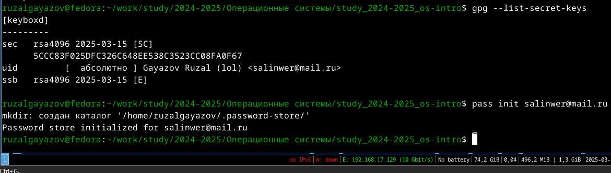
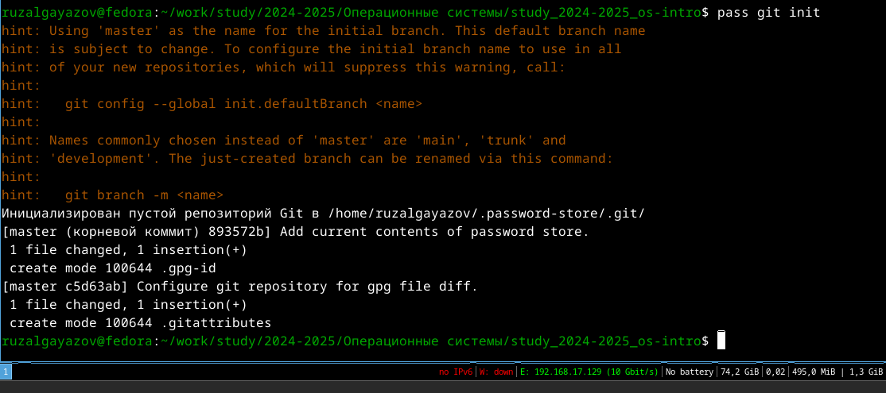
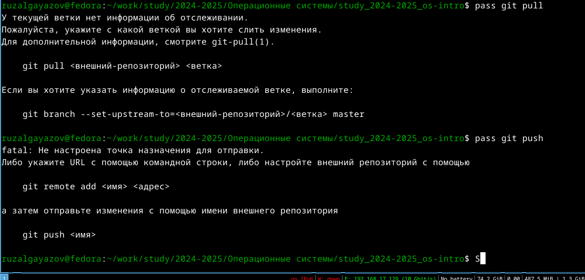
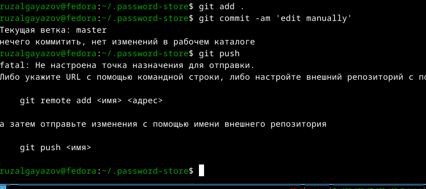
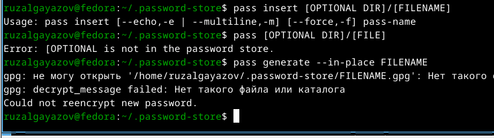
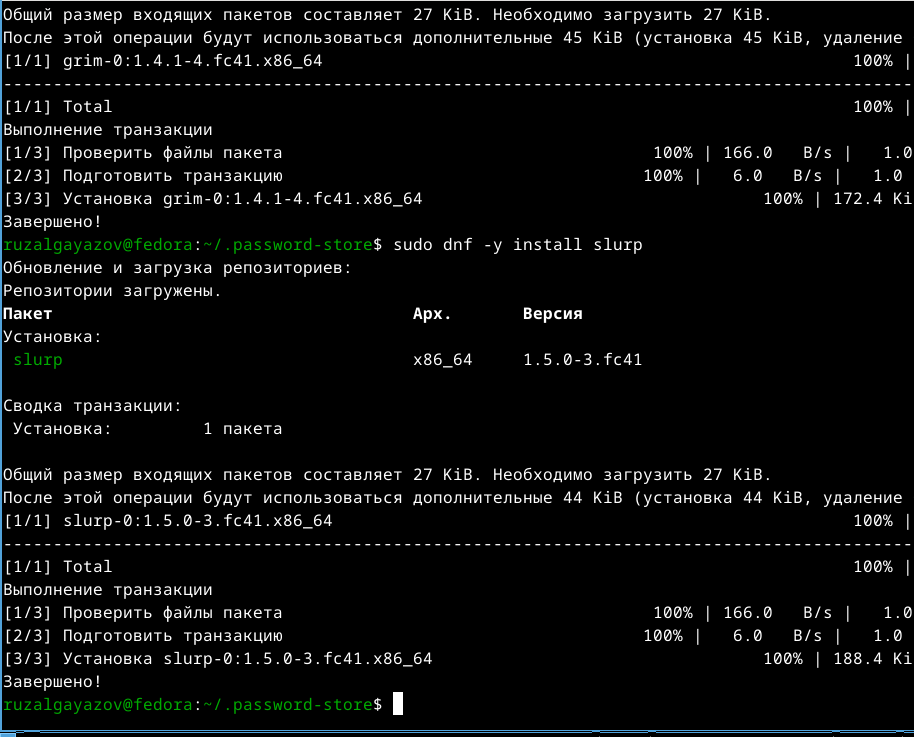
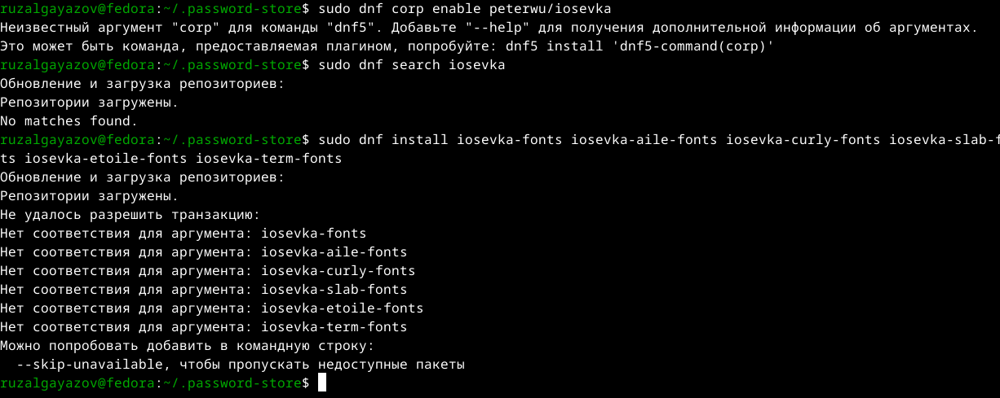
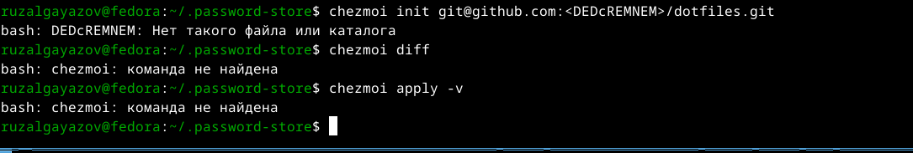
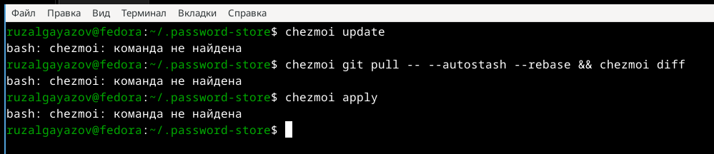

---
## Front matter
lang: ru-RU
title: Лабораторная работа №5
subtitle: Операционные системы
author:
  - Гаязов Рузаль, НКАбд-04-24
institute:
  - Российский университет дружбы народов, Москва, Россия
date: 18 февраля 2023

## i18n babel
babel-lang: russian
babel-otherlangs: english

## Formatting pdf
toc: false
toc-title: Содержание
slide_level: 2
aspectratio: 169
section-titles: true
theme: metropolis
header-includes:
 - \metroset{progressbar=frametitle,sectionpage=progressbar,numbering=fraction}
 - '\makeatletter'
 - '\beamer@ignorenonframefalse'
 - '\makeatother'
---

#Информация

##Цель работы

Цель данной лабораторной работы - научиться пользоваться менеджером паролей pass

##Задания 

1. Установить менджер паролей
2. Управлять файлами конфигурации
3.установить дополнительное программное обеспечение

##Выполнение лабораторной работы

Устанавливаю необходимое программное обеспечение  pass and go-pass (рис. @fig:001).

{#fig:001 width=70%}

## Базовая настройка 

Проверяю список ключей (рис. @fig:002).

{#fig:002 width=70%}

## Базовая настройка 

Создаю структуру (рис. @fig:003).

{#fig:003 width=70%}

## Базовая настройка 

Выполняю данные команды pass git push and pass git pull (рис. @fig:004).

{#fig:004 width=70%}

## Базовая настройка 

Прямое изменение (рис. @fig:005).

{#fig:005 width=70%}

## Настройка интерфейся с броузером

Установка (рис. @fig:006).

{#fig:006 width=70%}

## Настройка интерфейся с броузером

Сохраняю пароль (рис. @fig:007).

{#fig:007 width=70%}

## Установка дополнительного ПО

Установка (рис. @fig:008).

{#fig:008 width=70%}

## Установка дополнительного ПО

Устанавливаю шрифты (рис. @fig:009).

{#fig:009 width=70%}

## Установка дополнительного ПО

Усианавливаю бинарные файлы (рис. @fig:010).

{#fig:010 width=70%}

## Установка дополнительного ПО

Ошибка (рис. @fig:014).

{#fig:011 width=70%}

## Установка дополнительного ПО

Ошибка (рис. @fig:012).

{#fig:012 width=70%}

##Вывод

Я науичлся пользоваться менеджером паролей
